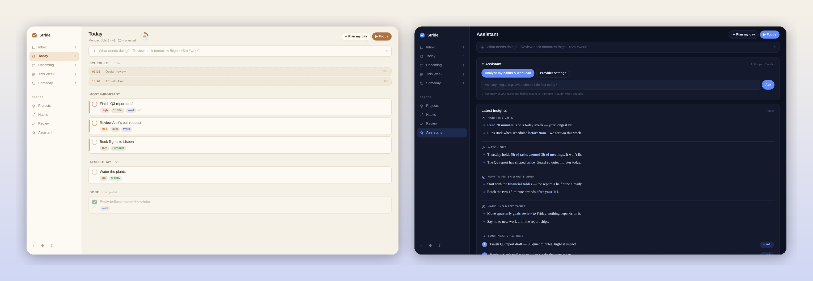

# Stride

A calm, fast task planner for people who want to get meaningful work done without burning out. Single HTML file, offline-first, with optional AI coaching and deep macOS integration.



Stride is built around one idea: **fewer decisions, less clutter, sustainable pace.** It guides you toward the next most important task instead of showing an endless list, warns you before you overcommit, and celebrates consistency over volume.

## Features

**Planning without friction.** One capture box that understands plain language — `Review deck tomorrow !high ~45m #work` sets the date, priority, estimate, and project in a single line. Inbox, Today, Upcoming, This Week, and Someday views; drag-and-drop reordering (dragging across days reschedules); subtasks, recurring tasks, projects, habits with streaks; a command palette (⌘K) and full keyboard control (press `?` for the map).

**Burnout prevention, built in.** Daily capacity tracking that counts your real meetings, overload warnings with a one-click Rebalance, a top-3 daily plan instead of a task avalanche, focus mode with break nudges after 50 minutes, and a Review view that celebrates showing up — not task volume.

**AI coaching (bring your own key).** Connect Anthropic, OpenAI, NVIDIA NIM, OpenRouter, or any OpenAI/Anthropic-compatible endpoint. The Assistant analyzes your habits, workload, calendar, and (optionally) Mac activity, then delivers a daily report: habit insights, mistakes to watch out for, and your next three actions — each addable as a task in one click. It can also break big tasks into steps.

**Deep macOS integration** (via a small local helper, all optional):

- **SQLite persistence** — everything lives in `stride.db`, queryable with plain SQL and shared across browsers.
- **Calendar** — reads Calendar.app or any ICS URL, shows your schedule alongside tasks, and subtracts meeting time from your day's capacity.
- **Apple Reminders sync** — mirrors your plan to a "Stride" list that iCloud puts on your iPhone; check items off on the phone and Stride completes them.
- **Activity awareness** (opt-in) — notices what you work on and reminds you about things you left unfinished.

**Eight themes**, light and dark, including Paper (warm sepia), Midnight, Forest, and Ink (monochrome).

## Installation

### Prerequisites

- Any modern browser. That's it for the basic app.
- **For the macOS integrations** (SQLite storage, Calendar, Reminders, activity awareness): Python 3, which comes with Xcode Command Line Tools — run `xcode-select --install` if you're not sure.
- **For AI features** (optional): an API key from Anthropic, OpenAI, OpenRouter, NVIDIA, or any compatible endpoint.

### 1. Clone

```bash
git clone https://github.com/YOUR-USERNAME/stride.git
cd stride
```

There is no build step and nothing to install — the app is a single HTML file.

### 2. Launch

**macOS (recommended):** double-click **Stride.app** in the cloned folder. It opens Stride in its own dock-able window and silently starts the local helper. On the very first launch macOS may warn about an unidentified app — right-click Stride.app → **Open** → **Open**. If double-clicking does nothing, restore the execute bit (git preserves it, but some download methods don't):

```bash
chmod +x Stride.app/Contents/MacOS/stride
```

To keep it in your Dock: launch it, right-click the Dock icon → Options → **Keep in Dock**.

**Any other OS, or browser-only:** open `index.html` directly. Everything works offline via browser storage. To also get SQLite persistence and the CORS proxy, run the helper manually in a second terminal:

```bash
python3 stride-helper.py
```

### 3. Verify it's working

Open the app — you'll see a few starter tasks explaining the basics. Check Settings (gear icon, bottom-left):

- **Local database** should read "stride.db · synced …" — the helper created `stride.db` in the project folder automatically and your data now survives browser resets. If it says "Not connected", the helper isn't running (harmless — the app falls back to browser storage).

### 4. Optional features (each takes ~1 minute)

All in Settings:

- **AI assistant** — pick a provider, paste your API key, click **Test**. Then press `9` for the Assistant view and hit "Analyze my habits & workload". Keys never leave your machine except to call your chosen provider directly.
- **Calendar** — paste an ICS URL (Google Calendar: Settings → your calendar → "Secret address in iCal format"), or tick **Use macOS Calendar**. First sync triggers a one-time macOS permission prompt.
- **Apple Reminders** — toggle **Sync plan to Reminders**. Your plan mirrors to a "Stride" list, which iCloud puts on your iPhone; items checked off on the phone complete in Stride. Approve the permission prompt on first sync.
- **Activity awareness** — toggle **Track my Mac activity** to get "you left this unfinished" reminders. Approve the Automation/Accessibility prompts (System Settings → Privacy & Security if they don't appear).

### Troubleshooting

- **"Helper offline" everywhere** → launch via Stride.app, or run `python3 stride-helper.py` manually; make sure port 8787 is free.
- **AI Test fails with a CORS message** → your provider blocks browser calls; the helper fixes this automatically, so make sure it's running.
- **Calendar/Reminders permission never appeared** → System Settings → Privacy & Security → Automation, allow `python3` for Calendar/Reminders; for activity titles also add `python3` under Accessibility.
- **Nuking a test install** → quit the window, delete `stride.db`, and clear the site data in your browser. Next launch starts fresh.

## Architecture

Three files, no dependencies, no build step:

- `index.html` — the entire app: UI, task engine, AI client, sync logic. Vanilla JS, ~3,000 lines.
- `stride-helper.py` — optional local connector on `127.0.0.1:8787` (Python 3 stdlib only): SQLite persistence, CORS proxy for AI providers that block browser calls, and AppleScript bridges to Calendar, Reminders, and System Events.
- `Stride.app` — a thin macOS launcher (shell script bundle) that starts the helper and opens the app in a chromeless browser window.

Data flow: the app saves to `localStorage` instantly (offline-first), then syncs to `stride.db` through the helper. On startup it adopts whichever copy is newer.

## Privacy

Everything stays on your machine. No accounts, no telemetry, no servers. The only data that ever leaves is the summary sent to *your chosen* AI provider when you use AI features — and those are off until you add a key. Activity tracking is off by default, records only app names and window titles, and keeps 14 days.

## Contributing

Issues and pull requests welcome. The codebase is deliberately simple — one HTML file, one Python file — so read through, keep changes small and dependency-free, and include a test where practical (see the jsdom test patterns in the repo history).

## License

[MIT](LICENSE) © 2026 Milan Niroula
