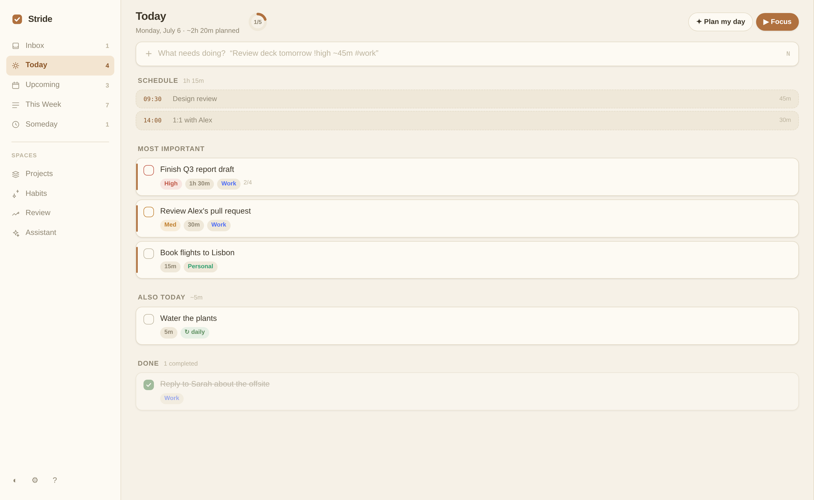
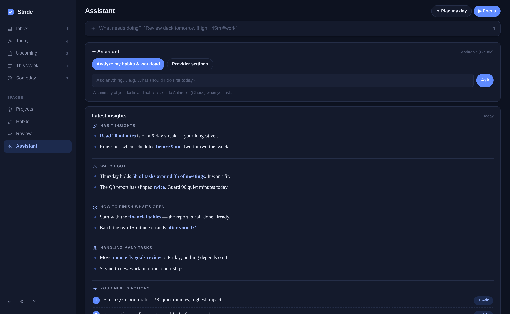

<div align="center">

# Stride

**A calm task planner, built for the Mac and Apple ecosystem.**

No accounts. No servers. No build step. No subscription.
Runs anywhere as a single HTML file — but on macOS it becomes something closer to a native app: SQLite on disk, Calendar.app, two-way Apple Reminders sync onto your iPhone, and Mac-activity-aware nudges, all driven by a small Python helper and a real Dock icon.

[](LICENSE)
[](#deep-macos-integration)
[](index.html)
[](index.html)
[](#privacy)

[Quick start](#quick-start) · [Features](#features) · [Screenshots](#screenshots) · [Architecture](#architecture) · [Privacy](#privacy)

</div>

---

Most task apps compete on how much they can hold. Stride competes on how little you have to think about. It surfaces the next most important thing instead of an endless list, tells you *before* you overcommit a day, and treats "showed up today" as more important than "cleared 40 tasks today."

If that resonates, **starring the repo** is the easiest way to help other burned-out list-makers find it.

## Screenshots

<table>
<tr>
<td width="34%"></td>
<td width="33%"></td>
<td width="33%"></td>
</tr>
<tr>
<td align="center"><sub>Today + AI Assistant</sub></td>
<td align="center"><sub>Paper theme</sub></td>
<td align="center"><sub>Midnight theme</sub></td>
</tr>
</table>

## Why Stride

|  | Stride | Typical SaaS planner |
|---|---|---|
| Setup | Open one HTML file | Sign up, onboarding, download an app |
| Data | Yours, on disk (`stride.db` / localStorage) | Their servers |
| Offline | Full app, no network needed | Degraded or unusable |
| Cost | Free, forever, MIT-licensed | Free tier → paywall |
| AI | Optional, bring your own key, direct to provider | Bundled, usage-metered, or absent |
| Codebase | ~3,000 lines you can actually read in an evening | Millions of lines you'll never see |
| On Mac | Real Dock icon, Calendar.app, Reminders → iPhone via iCloud | Its own silo, no OS integration |

## Features

**Planning without friction.** One capture box that understands plain language — `Review deck tomorrow !high ~45m #work` sets the date, priority, estimate, and project in a single line. Inbox, Today, Upcoming, This Week, and Someday views; drag-and-drop reordering (dragging across days reschedules); subtasks, recurring tasks, projects, habits with streaks; a command palette (⌘K) and full keyboard control (press `?` for the map).

**Burnout prevention, built in.** Daily capacity tracking that counts your real meetings, overload warnings with a one-click Rebalance, a top-3 daily plan instead of a task avalanche, focus mode with break nudges after 50 minutes, and a Review view that celebrates showing up — not task volume.

### Deep macOS integration

This is where Stride stops acting like a webpage. A small local Python helper (stdlib only, no install) turns it into something that behaves like a first-class citizen of the Apple ecosystem — all optional, all opt-in:

- **A real Mac app** — `Stride.app` launches it in its own dock-able, chromeless window with its own icon, not a browser tab.
- **SQLite persistence** — everything lives in `stride.db` on your disk, queryable with plain SQL, shared across browser windows.
- **Calendar.app** — reads your real calendar (or any ICS URL), shows your schedule alongside tasks, and subtracts meeting time from your day's capacity automatically.
- **Apple Reminders ↔ iPhone sync** — your plan mirrors to a "Stride" list that iCloud pushes to your phone; check something off on iOS and Stride completes it on the Mac next sync, no app on the phone required.
- **Activity awareness** (opt-in) — notices what you were working on via System Events and reminds you about things you left unfinished.

**AI coaching (bring your own key).** Connect Anthropic, OpenAI, NVIDIA NIM, OpenRouter, or any OpenAI/Anthropic-compatible endpoint. The Assistant analyzes your habits, workload, calendar, and (optionally) Mac activity, then delivers a daily report: habit insights, mistakes to watch out for, and your next three actions — each addable as a task in one click. It can also break big tasks into steps.

**Eight themes**, light and dark, including Paper (warm sepia), Midnight, Forest, and Ink (monochrome).

**Not on a Mac?** Everything above the macOS section works the same in any modern browser, fully offline, via `localStorage` — you just won't get Calendar/Reminders/SQLite/activity awareness without the helper, which is macOS-only (AppleScript-driven).

## Quick start

```bash
git clone https://github.com/mimi146/stride.git
cd stride
```

There's nothing to install — the app is a single HTML file.

**macOS (recommended):** double-click **Stride.app**. It opens Stride in its own dock-able window and silently starts the local helper. On first launch, macOS may warn about an unidentified app — right-click Stride.app → **Open** → **Open**. If double-clicking does nothing, restore the execute bit (git preserves it, but some download methods don't):

```bash
chmod +x Stride.app/Contents/MacOS/stride
```

**Any other OS, or browser-only:** open `index.html` directly. Everything works offline via browser storage. To also get SQLite persistence and the CORS proxy, run the helper manually in a second terminal:

```bash
python3 stride-helper.py
```

Open the app and you'll see a few starter tasks explaining the basics. Check Settings (gear icon, bottom-left) — "Local database" should read `stride.db · synced …` once the helper picks it up.

<details>
<summary><b>Full install guide</b> — icons, Dock, AI setup, Calendar, Reminders, activity awareness, troubleshooting</summary>

### Prerequisites

- Any modern browser. That's it for the basic app.
- **For the macOS integrations** (SQLite storage, Calendar, Reminders, activity awareness): Python 3, which comes with Xcode Command Line Tools — run `xcode-select --install` if you're not sure.
- **For AI features** (optional): an API key from Anthropic, OpenAI, OpenRouter, NVIDIA, or any compatible endpoint.

### Give Stride its own icon (optional, recommended)

The launcher window borrows Chrome's Dock icon. For a real Stride icon, install it as a Chrome app once — open `http://127.0.0.1:8787/` in regular Chrome (helper must be running), click the **install icon** at the right end of the address bar (or ⋮ → Cast, Save and Share → Install page as app), and confirm. Stride now lives in Launchpad and the Dock with its own icon and window; your data carries over automatically from `stride.db`. To keep the launcher in your Dock instead: launch it, right-click the Dock icon → Options → **Keep in Dock**.

### Optional features (each takes ~1 minute)

All in Settings:

- **AI assistant** — pick a provider, paste your API key, click **Test**. Then press `9` for the Assistant view and hit "Analyze my habits & workload". Keys never leave your machine except to call your chosen provider directly.
- **Calendar** — paste an ICS URL (Google Calendar: Settings → your calendar → "Secret address in iCal format"), or tick **Use macOS Calendar**. First sync triggers a one-time macOS permission prompt.
- **Apple Reminders** — toggle **Sync plan to Reminders**. Your plan mirrors to a "Stride" list, which iCloud puts on your iPhone; items checked off on the phone complete in Stride. Approve the permission prompt on first sync.
- **Activity awareness** — toggle **Track my Mac activity** to get "you left this unfinished" reminders. Approve the Automation/Accessibility prompts (System Settings → Privacy & Security if they don't appear).

### Troubleshooting

- **"Helper offline" everywhere** → launch via Stride.app, or run `python3 stride-helper.py` manually; make sure port 8787 is free.
- **AI Test fails with a CORS message** → your provider blocks browser calls; the helper fixes this automatically, so make sure it's running.
- **Calendar/Reminders permission never appeared** → System Settings → Privacy & Security → Automation, allow `python3` for Calendar/Reminders; for activity titles also add `python3` under Accessibility.
- **Nuking a test install** → quit the window, delete `stride.db`, and clear the site data in your browser. Next launch starts fresh.

</details>

## Architecture

Three files, no dependencies, no build step:

- `index.html` — the entire app: UI, task engine, AI client, sync logic. Vanilla JS, ~3,000 lines.
- `stride-helper.py` — optional local connector on `127.0.0.1:8787` (Python 3 stdlib only): SQLite persistence, CORS proxy for AI providers that block browser calls, and AppleScript bridges to Calendar, Reminders, and System Events.
- `Stride.app` — a thin macOS launcher (shell script bundle) that starts the helper and opens the app in a chromeless browser window.

Data flow: the app saves to `localStorage` instantly (offline-first), then syncs to `stride.db` through the helper. On startup it adopts whichever copy is newer.

## Privacy

Everything stays on your machine. No accounts, no telemetry, no servers. The only data that ever leaves is the summary sent to *your chosen* AI provider when you use AI features — and those are off until you add a key. Activity tracking is off by default, records only app names and window titles, and keeps 14 days.

## Contributing

Issues and pull requests welcome. The codebase is deliberately simple — one HTML file, one Python file — so read through, keep changes small and dependency-free, and include a test where practical (see the jsdom test patterns in the repo history).

If Stride is useful to you, a ⭐ on the repo goes a long way — it's the main way people discover it.

## License

[MIT](LICENSE) © 2026 Milan Niroula
</content>
